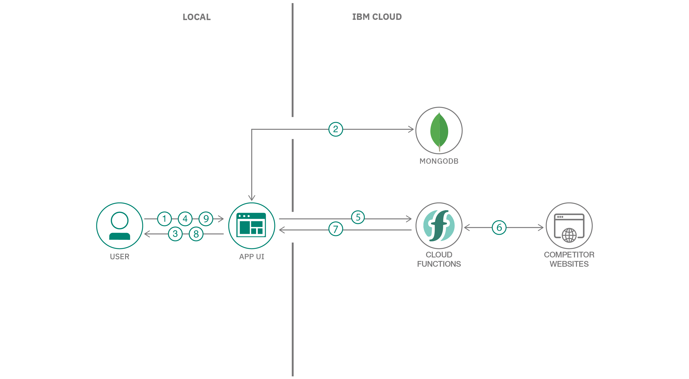

# Build interactive pricing tool for e-commerce vendors

Any e-commerce vendor who is selling a competitive product online, would want their sales to be maximum. One of the important factor that users see in buying a competitive product is the selling price that the vendor is offering. In order to sell maximum products a vendor would need to give the product at best selling price in the market, without compromising on the desired profits.

In this code pattern, we will develop an interactive UI integrated with custom backend that will help the e-commerce vendors decide on an optimal selling price such that their chances of sales will increase and at the same time maintain their desired profits.



## Flow

1. User launches the application.
2. Product details are retrieved from MongoDB.
3. List of products being sold are displayed. 
4. User enters `Profit Margin` and `Minimum Requied Profit` for the product being sold.
5. This information is sent to the backend cloud functions.
6. Cloud Functions scrapes the competitors product details from their websites.
7. Custom algorithm computes the optimal price and sends itback to the application.
8. An interacive tool is displayed to the user on the UI.
9. User uses the tool and information on the UI to set a competitive price.

## Pre-requisites
* [IBM Cloud account](https://www.ibm.com/cloud/): Create an IBM Cloud account.
* [Python 3](https://www.python.org/downloads/): Install python 3.

# Steps

Please follow the below to setup and run this code pattern.

1. [Clone the repo](#1-clone-the-repo)
2. [Setup MongoDB on IBM Cloud](#2-setup-mongodb-on-ibm-cloud)
3. [Host competitors webpage on cloud](#3-host-competitors-webpage-on-cloud)
4. [Setup IBM Cloud Function](#4-setup-ibm-cloud-function)
5. [Run the application](#5-run-the-application)
6. [Analyze the results](#6-analyze-the-results)

### 1. Clone the repo

Clone this [git repo](https://github.com/IBM/analyze_ecommerce_websites_and_recommend_optimal_price).
Else, in a terminal, run:

```
$ git clone https://github.com/IBM/analyze_ecommerce_websites_and_recommend_optimal_price
```
### 2. Setup MongoDB on IBM Cloud

## Managed Cloud instance

- Navigate to IBM Cloud console in your browser, search for MongoDB, and provision an instance of the Databases for MongoDB service. Provision an instance, then click **Service Credentials > New Credential**. 


- Download the credentials; we will copy them into the notebook later.


### 3. Host competitors webpage on cloud

- Before you proceed, make sure you have installed [IBM Cloud CLI](https://cloud.ibm.com/docs/cli?topic=cloud-cli-getting-started&locale=en-US) in your deployment machine.

- From the cloned repo, goto **competitors-websites** directory in terminal, and run the following commands to deploy the Application to IBM Cloud Foundry.

```bash
$ cd competitors-websites/
```

* Log in to your IBM Cloud account, and select an API endpoint.
```bash
$ ibmcloud login
```

>NOTE: If you have a federated user ID, instead use the following command to log in with your single sign-on ID.

```bash
$ ibmcloud login --sso
```

* Target a Cloud Foundry org and space:
```bash
$ ibmcloud target --cf
```

* From within the competitors-websites directory push your app to IBM Cloud.
```bash
$ ibmcloud cf push competitors-websites
```

- The [manifest.yml](competitors-websites/manifest.yml) file will be used here to deploy the application to IBM Cloud Foundry.

- On Successful deployment of the application you will see something similar on your terminal as shown.

<pre><code>Invoking 'cf push'...

Pushing from manifest to org XXXXXXXX@in.ibm.com / space dev as XXXXXXXX@in.ibm.com...

...

Waiting for app to start...

name:              competitors-websites
requested state:   started
routes:            <b>competitors-websites.xx-xx.mybluemix.net </b>
last uploaded:     Sat 16 May 18:05:16 IST 2020
stack:             cflinuxfs3
buildpacks:        python

type:            web
instances:       1/1
memory usage:    256M
start command:   python app.py
     state     since                  cpu     memory           disk           details
#0   <b>running</b>   2020-05-16T12:36:15Z   25.6%   116.5M of 256M   796.2M of 1
</code></pre>

* Once the app is deployed you can visit the `routes` to launch the application.

>Example: 
 > - http://competitors-websites.xx-xx.mybluemix.net/vendor1
 > - http://competitors-websites.xx-xx.mybluemix.net/vendor2
 > - http://competitors-websites.xx-xx.mybluemix.net/vendor3

>> Note: Since this is an open source project it is restricted to extract information from private ecommerce websites. Hence we are showcasing the pattern with custom websites.

- Copy the URL in this step, eg: `http://competitors-websites.xx-xx.mybluemix.net/` .This will be used in the next step.

### 4. Setup IBM Cloud Function

IBM Cloud Function is a Serverless Architecture where in a user can write a snippet of code and run it as API's without worrying about deploying it. A code snippet can easily be attached to an already existing deployment to add more Functionality.

- Goto [IBM Cloud Resources](https://cloud.ibm.com/resources), and click on the **hamburger menu** and select **Functions > Actions** as shown. 


- In Cloud Actions page, click on **Create** to get started.


- A **Single entities** list with Actions, Triger, Sequence, Quickstart Templates and Installable Packages will be presented. Select the **Action** to proceed.


- Enter a `name` for the action, you can either create a custom package or leave it as `default package` and lastly select the `Runtime` as `Python 3.7` and click on **Create**.


- An IDE with Hello World code written in python will be presented, replace everything from the IDE with the code present in the file [`pricing-tool.py`](pricing-tool.py).


- After adding the code, update the URL from [3rd step](#3-host-competitors-webpage-on-cloud) as shown below. Click on the **Save** button to save the cloud function.


- Once the Cloud Function is code ready, you need to expose an API so that the Backend server can interact with the written code. Click on **Endpoints** and **Enable as Web Action** and finally click on **Save** button as shown.


- After you have enabled as **Web Action** you will see a `URL`, copy the `URL` as it will be used in the next step.


- At this point, you have successfully setup a serverless cloud function.

### 5. Run the application

- Add the **Web Action** URL copied in [Step 4](#4-setup-ibm-cloud-function) and paste it on line number `47` in [static/javascript/script.js](static/javascript/script.js)
<pre>
var url = "Enter the cloud functions url here";
</pre>

- Once the **Web Action** URL is added in the code now you can run the code in your local machine in one of the two ways mentioned below.

<details><summary><b>With Docker Installed</b></summary>

- change directory to repo parent folder :
    
```bash
$ cd analyze_ecommerce_websites_and_recommend_optimal_price/
```

- Build the **Dockerfile** as follows :

```bash
$ docker image build -t recommend_optimal_price .
```

- once the dockerfile is built run the dockerfile as follows :

```bash
$ docker run -p 8080:8080 recommend_optimal_price
```

- The Application will be available on <http://localhost:8080>

</details>

<details><summary><b>Without Docker</b></summary>

- Install the python libraries as follows:

    - change directory to repo parent folder
    
    ```bash
    $ cd analyze_ecommerce_websites_and_recommend_optimal_price
    ```

    - use `python pip` to install the libraries

    ```bash
    $ pip install -r requirements.txt
    ```

- Finally run the application as follows:

```bash
$ python app.py
```

- The Application will be available on <http://localhost:8080>

</details>

### 6. Analyze the results

- After you launch the application, you will see a list of products the user/vendor is selling.


- Enter details as shown below and click on `Update Price`. 

>> NOTE: Since the vendor gets the product directly from the manufacturer, he/she would be getting the product for a very low price compared to retail price.This difference in retail price and the price that the vendor bought is profit margin. `Enter profit margin` field takes in the total profit margin the user/vendor has on the product. `Enter minimum required profit` field takes in the minimum profit the user/vendor is planning to make the product.


- Application gets the prices of the competitors who are selling this product online. Based on the data given, the application compares the prices of the competitors and returns an optimal selling price which could improve user's chances of selling the product and at the same time maintain the desired profits.

<p float="left">
  
   
  
</p>


<table>
  <thead>
    <tr>
      <td align="left">
        :information_source: Refer to the below information to understand the terminology used on the UI tool.
      </td>
    </tr>
  </thead>

  <tbody>
    <tr>
      <td>
        <ul>
          <li><b>Minimum Selling Price :</b> The minumum price at which the vendor needs to sell the product inorder to get his/her Minimum Required Profit.</li>
          <li><b>Optimal Selling Price :</b> A price given by the application algorithm that could improve vendor's chances of selling the product and at the same time maintain the desired profits.</li>
             <li><b>Total Profit :</b> Profit that vendor would get if the he/she sells at the Optimal Selling Price. </li>
          <li><b>Profit Range :</b> A dynamic slider that allows the user/vendor to see where his/her selling price stands in the market.</li>
             <li><b>Optimal Price Range :</b> A dynamic slider that allows the user/vendor to see where his/her selling price stands in the market.</li>
             <li><b>Final Selling Price (Custom) :</b> In this field the user/vendor can enter a price manually that he/she would want the product to be sold.</li>
             <li><b>Final Profit:</b> Final profit that the user/vendor would get after he/she sets the selling price.</li>
          <li><b>Update Price:</b> Updates the price online on your e-commerce website.</li>
        </ul>
      </td>
    </tr>
  </tbody>
</table>


- After you set your price click on the `Update Price` button. This updates the price online on your e-commerce website.


## License

[Apache 2.0](LICENSE)
